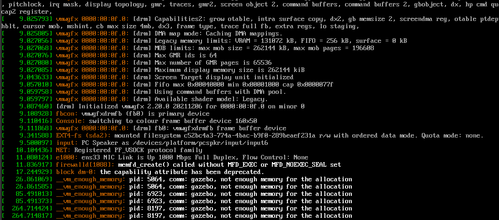

# Gazebo OpenEuler测试
## 环境配置
OS:OpenEuler 24.03 x86_64 WSL   
硬件平台：
CPU: AMD Ryzen9 7940HX    
GPU0: NVIDIA RTX 4060 Laptop(8G VRAM)    
GPU1: AMD Radeon 610M   
内存容量:64G
### 安装gazebo
```shell
cat << EOF > /etc/yum.repos.d/gazebo.repo
[openEulerROS-humble-3rdparty]
name=openEulerROS-humble
baseurl=https://eulermaker.compass-ci.openeuler.openatom.cn/api/ems1/repositories/ROS-SIG-Multi-Version_ros-humble_openEuler-24.03-LTS-ROS-3rdparty/openEuler%3A24.03-LTS/x86_64 
enabled=1
gpgcheck=0
EOF
dnf install gazebo*
```
## 测试gazebo
启动时报错
```shell
gazebo: error while loading shared libraries: libhdf5.so.310: cannot open shared object file: No such file or directory
```
`ldd`查看发现确实没有对应的.so
```shell
ifreturn@DESKTOP-UN7SN9H ~> ldd /usr/bin/gazebo|grep hdf
        libhdf5.so.310 => not found
        libhdf5_hl.so.200 => /usr/lib64/libhdf5_hl.so.200 (0x00007f88ade45000)
        libhdf5.so.200 => /usr/lib64/libhdf5.so.200 (0x00007f88ada4f000)
```
locate发现`/usr/lib64/mpich/lib/libhdf5.so.310`    
（以下方法仅作测试使用，不建议学习）   
在/etc/ld.so.conf.d中添加文件`custom.conf`并刷新ld缓存
```shell
echo "/usr/lib64/mpich/lib" > /etc/ld.so.conf.d/custom.conf
ldconfig
```
再次启动gazebo

正常启动，观测到严重的性能问题，控制台输出error
```shell
MESA-LOADER: failed to open zink: /usr/lib64/dri/zink_dri.so: cannot open shared object file: No such file or directory (search paths /usr/lib64/dri, suffix _dri)
failed to load driver: zink
MESA-LOADER: failed to open zink: /usr/lib64/dri/zink_dri.so: cannot open shared object file: No such file or directory (search paths /usr/lib64/dri, suffix _dri)
failed to load driver: zink
MESA-LOADER: failed to open zink: /usr/lib64/dri/zink_dri.so: cannot open shared object file: No such file or directory (search paths /usr/lib64/dri, suffix _dri)
failed to load driver: zink
AL lib: (WW) GetSymbol: Failed to load jack_error_callback: /usr/lib64/libjack.so.0: undefined symbol: jack_error_callback
AL lib: (WW) jack_msg_handler: Cannot connect to server socket err = No such file or directory
AL lib: (WW) jack_msg_handler: Cannot connect to server request channel
AL lib: (WW) jack_msg_handler: jack server is not running or cannot be started
AL lib: (WW) jack_msg_handler: JackShmReadWritePtr::~JackShmReadWritePtr - Init not done for -1, skipping unlock
AL lib: (WW) jack_msg_handler: JackShmReadWritePtr::~JackShmReadWritePtr - Init not done for -1, skipping unlock
AL lib: (WW) ALCjackBackendFactory_init: jack_client_open() failed, 0x11
AL lib: (WW) alc_initconfig: Failed to initialize backend "jack"
```
安装mesa相关包
```shell
dnf install mesa*
```
仍无改善   
在源中搜索`zink_dri.so`
```shell
dnf provides */zink_dri.so                                                                                                                 
Error: No matches found. If searching for a file, try specifying the full path or using a wildcard prefix ("*/") at the beginning.
```
无结果

## 在Vmware中进行测试
首先安装上`xfce`作为桌面环境，个人习惯`gdm`作为显示管理器
```shell
dnf install xfce4-* gdm
systemctl enable gdm --now
```
按照上述方法配置环境后，启动gazebo立即导致xfce崩溃，复现了[之前其他同学测试的情况](https://github.com/jingliang0910/PLCT-jiachenPlan/tree/main/gazebo_Problem)   
查看`dmesg`有：

考虑到这时是离电环境（N卡关闭），查看WSL中的情况，也会打不开gazebo    
wsl的`dmesg`为
```log
[   56.677400] CPU: 1 PID: 1199 Comm: gzclient Not tainted 5.15.167.4-microsoft-standard-WSL2 #1
[   56.678210] RIP: 0033:0x7fe68179aa7c
[   56.678449] Code: ff ff 0f 46 da eb 89 0f 1f 80 00 00 00 00 b8 ba 00 00 00 0f 05 89 c3 e8 e2 19 05 00 44 89 ea 89 de 89 c7 b8 ea 00 00 00 0f 05 <89> c3 f7 db 3d 00 f0 ff ff b8 00 00 00 00 0f 47 c3 e9 78 ff ff ff
[   56.679997] RSP: 002b:00007ffc06dae410 EFLAGS: 00000246 ORIG_RAX: 00000000000000ea
[   56.680753] RAX: 0000000000000000 RBX: 00000000000002b9 RCX: 00007fe68179aa7c
[   56.681691] RDX: 0000000000000006 RSI: 00000000000002b9 RDI: 00000000000002b9
[   56.682234] RBP: 00007fe66acd9e00 R08: 00005613b4cfe010 R09: 0000000000000007
[   56.683426] R10: 0000000000000008 R11: 0000000000000246 R12: 00007ffc06dae700
[   56.683854] R13: 0000000000000006 R14: 00007ffc06dae700 R15: 00007ffc06dae708
[   56.684283] FS:  00007fe66acd9e00 GS:  0000000000000000
[   56.691841] systemd-coredump[1216]: Failed to connect to coredump service: No such file or directory
```
考虑到可能是WSL图形化的问题，删除并重新链接/tmp/.X11-unix
```shell
rm -r /tmp/.X11-unix
ln -sf /mnt/wslg/.X11-unix/ /tmp/
```
WSL恢复正常，且性能正常（TODO:找出原因）    
将分配给vmware的内存从4G提高到16G，可以正常启动，降低到8G，无法正常启动。    
此情况下，不使用`gazebo`而是依次分别调用`gzserver`和`gzclient`，可以正常启动，结合`dmesg`相关信息，猜测是调用`gazebo`时产生的`fork`操作导致了子进程过多复制父进程内存而产生了oom杀死了图形化界面

## 发现的问题
1. 没有软件包提供`/usr/lib/libhdf5.so.310`，而系统中存在`/usr/lib64/mpich/lib/libhdf5.so.310`
2. 在小内存时(<=16G)，启动gazebo会导致oom