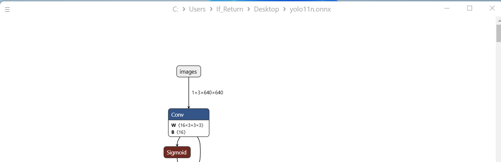
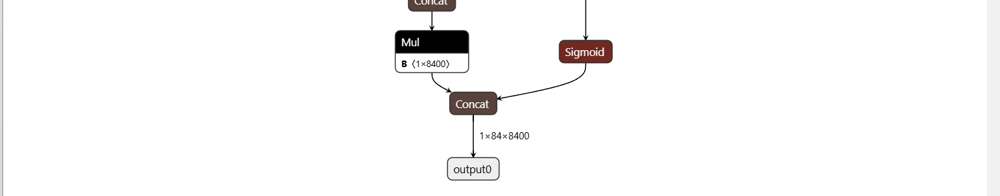

# 在milk-v meles上测试ROS与yolo算法
## 24.03环境配置
使用已经适配过的23.09版本镜像，刷入后使用lpi4a的rootfs替换  
替换后有一些问题：
1. 需要更改fstab到正确的设备来正确挂载boot
2. 拷贝一些modules到新的rootfs来适配部分硬件
3. 拷贝博通网卡的firmware到新的rootfs来启用wifi
4. 需要在rc.local中配置pwm输出来启用风扇
5. 显卡与NPU缺少驱动
6. 6.6内核对应的dtb有错误  
由于显卡和NPU暂时缺少驱动，只能先使用23.09版本测试yolo
## 23.09环境配置
这里参考荔枝派的文档(https://wiki.sipeed.com/hardware/zh/lichee/th1520/lpi4a/8_application.html#Yolov5n)  
由于oerv.wiki暂时无法访问（截至2025-4-24），没拿到23.09不带ros的镜像，故不包含ros的配置
### python环境
#### 安装预编译的python wheel
由于需要同时使用ros的环境，所以不采取虚拟环境安装，
```shell
git clone -b python3.11 https://github.com/zhangwm-pt/prebuilt_whl.git
cd prebuilt_whl
pip install numpy-1.25.0-cp311-cp311-linux_riscv64.whl
pip install kiwisolver-1.4.4-cp311-cp311-linux_riscv64.whl
pip install Pillow-9.5.0-cp311-cp311-linux_riscv64.whl
pip install matplotlib-3.7.2.dev0+gb3bd929cf0.d20230630-cp311-cp311-linux_riscv64.whl
pip install pycocotools-2.0.6-cp311-cp311-linux_riscv64.whl
pip3 install loguru-0.7.0-py3-none-any.whl
pip3 install torch-2.0.0a0+gitc263bd4-cp311-cp311-linux_riscv64.whl
pip3 install MarkupSafe-2.1.3-cp311-cp311-linux_riscv64.whl
pip3 install torchvision-0.15.1a0-cp311-cp311-linux_riscv64.whl
pip3 install psutil-5.9.5-cp311-abi3-linux_riscv64.whl
pip3 install tqdm-4.65.0-py3-none-any.whl
pip3 install tabulate-0.9.0-py3-none-any.whl
```
这里由于`ultralytic`需求opencv-python版本>=3.6.0，进行了对opencv-python的交叉编译，需要先交叉编译python，之后指定host与target的python进行编译即可，工具链可以在玄铁官网找到,[此处](https://www.xrvm.cn/community/download)  
一般可以直接下载仓库中的opencv-python安装  
2. yolo环境配置
```shell
pip install ultralytics
```

ros包配置与测试和其他架构相同，可见https://openeuler-ros-docs.readthedocs.io/en/latest/other-tutorials/yolo-ros.html


## hhb配置
参考https://www.yuque.com/za4k4z/yp3bry/tx9hcuw35s9x24po
### 模型编译
首先配置好yolo环境，这里使用python包`ultralytics`  
```
 yolo export model=yolo11n.pt format=onnx
```
之后导出onnx并使用hhb工具量化：  
使用docker安装hhb:
```
docker pull hhb4tools/hhb
docker run hhb4tools/hhb
```

1. 使用netron查看输入与输出，如图，输入为images，输出为output0，input shape为1x3x640x640



2. 选取calibrate-dataset,这里使用一张公交车的图[bus](bus.jpg)  
3. 选取量化方式，根据玄铁的[官方文档](https://www.xrvm.cn/document?temp=supported-by-platform-operators&slug=hhb)，选取支持算子较多的int8_asym

命令行如下：
```
 hhb -C --model-file ./yolo11n.onnx --data-scale-div 255 --board th1520 --input-name "images" --output-name "output0" --input-shape "1 3 640 640" --calibrate-dataset bus.jpg  --quantization-scheme "int8_asym"
```
测试yolo11模型需要一个不支持的算子`batch_matmul`，无法使用，使用yolov8则可以完成编译
这里查看yolov8n的输入输出和yolo11n相同，不再赘述。
```
 yolo export model=yolov8n.pt format=onnx
 hhb -C --model-file ./yolov8n.onnx --data-scale-div 255 --board th1520 --input-name "images" --output-name "output0" --input-shape "1 3 640 640" --calibrate-dataset bus.jpg  --quantization-scheme "int8_asym"
```
4. 将产生的hhb_out目录传到开发板上
```
scp -r ./hhb_out openeuler@your-meles-ip:/home/openeuler/
```

5. 在meles上测试  
这里假定meles上存在cat.jpg作为测试图片，可以任意取一张测试图片
```shell
#在meles上操作
cd ~/hhb_out
lsmod #确认vha vha_info imgmem是否存在
#如果不存在的话
#modprobe vha
#modprobe vha_info
#给/dev/vha0权限
chmod 777 /dev/vha0
./hhb_runtime hhb.bm ~/cat.jpg
```

在这里遇到问题，在加载vha驱动时报错
```log
[openeuler@openeuler-riscv64 ~]$ sudo modprobe vha
[sudo] password for openeuler:
[  432.441337] vha_plat_probe: Version: VHA DT driver version : REL_3.8-cl6140200
[  432.441337]
[  432.450087] vha_plat_probe: registers 0xfffc800000-0xfffc8fffff
[  432.456062] ax3xxx-nna fffc800000.vha: trimming system conf for core region!
[  432.463236] ax3xxx-nna fffc800000.vha: vha_plat_dt_hw_init dev->dma_mask : 0000000040754457 : 0xffffffff
[  432.472821] ax3xxx-nna fffc800000.vha: vha_plat_dt_hw_init forcing custom mask from DT : 0xffffffffff
[  432.482186] ax3xxx-nna fffc800000.vha: vha_dev_get_props: Product id: 0x8470000
[  432.489548] ax3xxx-nna fffc800000.vha: vha_dev_get_props: Core id: 0x1c0004190005de
[  432.497232] ax3xxx-nna fffc800000.vha: vha_dev_get_props: MMU version:3 (40bit)
[  432.504583] ax3xxx-nna fffc800000.vha: vha_dev_get_props: Total onchip memory: 0 [kB]
[  432.512435] ax3xxx-nna fffc800000.vha: vha_dev_get_props: Devices: DUMMY:0 CNN:1
[  432.520457] ax3xxx-nna fffc800000.vha: supply soc_dvdd08_ap not found, using dummy regulator
[  432.529299] ax3xxx-nna fffc800000.vha: dev_pm_opp_set_regulators: no regulator (soc_dvdd08_ap) found: -19
[  432.538906] ax3xxx-nna fffc800000.vha: Failed to set regulators.
[  432.544984] ax3xxx-nna fffc800000.vha: vha_devfreq_init: Failed to vha_devfreq_opp_init.
[  432.553307] ax3xxx-nna fffc800000.vha: failed to add vha dev to devfreq!
[  432.560134] ax3xxx-nna fffc800000.vha: vha_devfreq_suspend: Failed to suspend the vha_devfreq.
[  432.568805] ax3xxx-nna fffc800000.vha: vha_plat_runtime_suspend: Failed to suspend the vha devfreq!
[  432.577994] ax3xxx-nna fffc800000.vha: vha_add_dev: Core freq[kHz]: to be calibrated
[  432.585801] ax3xxx-nna fffc800000.vha: failed to intialize driver core!
```
在运行hhb编译结果时报错
```log
[openeuler@openeuler-riscv64 hhb_out]$ ./hhb_runtime hhb.bm ~/cat.png
Strided_slice software implementation in nna_ddk has memory leak, please use heterogeneous execution.Strided_slice software implementation in nna_ddk has memory leak, please use heterogeneous execution.INFO: Mapping phase 'Convert to CnnModel' - Started...
ERROR: (NNA_INTERNAL_FUNC) (/usr/src/debug/npu-ax3386/1.0-r0/lib/source/offline/mapping_tool/CnnNode.hpp:1359) All inputs must have the same #axes.
[  564.767597] Unable to handle kernel paging request at virtual address 00000012fffffffb
ERROR: (NNA_INTE[  564.776472] Oops [#1]
RNAL_FUNC) Failu[  564.780061] Modules linked in: vha_info vha img_mem iptable_nat ip6table_filter ip6_tables bpfilter pvrsrvkm dwc3 brcmfmac roles etnaviv dwc3_thead brcmutil thead_ddr_pmu gpu_sched
re initialising [  564.797528] CPU: 2 PID: 2287 Comm: hhb_runtime Not tainted 5.10.113+ #1
layer 'img_conca[  564.805534] epc : misc_open+0x66/0x146
t19'
ERROR: (NN[  564.810655]  ra : misc_open+0x40/0x146
A_INTERNAL_FUNC)[  564.815787] epc: ffffffe0008f0400 ra : ffffffe0008f03da sp : ffffffe10df6fb40
 Failure to init[  564.824305]  gp : ffffffe002817210 tp : ffffffe10f7fa880 t0 : ffffffe1120b9200
ialise dimension[  564.832909]  t1 : 0000000000000030 t2 : 000000000000000f s0 : ffffffe10df6fb90
s of network
ER[  564.841513]  s1 : 00000012fffffffb a0 : ffffffe0018fc0e8 a1 : 0000000000000128
ROR: (NNA_INTERN[  564.850118]  a2 : 0000000000000000 a3 : ffffffe1004ced78 a4 : 0000000000000000
AL_FUNC) CNN Mod[  564.858723]  a5 : 0000001300000013 a6 : 0000000000000064 a7 : 0000000000010000
el generation fa[  564.867328]  s2 : 0000000000000075 s3 : ffffffe0027373c0 s4 : ffffffe1120b9100
iled: std::excep[  564.875934]  s5 : ffffffe102ce5df0 s6 : 0000000000000000 s7 : ffffffe0027373a0
tion
ERROR: (cs[  564.884538]  s8 : 0000000000008002 s9 : 0000000000000000 s10: 000000000012d8d0
iImgdnnGenerateM[  564.893143]  s11: ffffffe10df6fd18 t3 : 8080808080808080 t4 : 0000000000040000
BS) Error when c[  564.901748]  t5 : fefefefefefefeff t6 : ffffffffffffffcf
reating imgdnn n[  564.908443] status: 0000000200000120 badaddr: 00000012fffffffb cause: 000000000000000d
etwork binary
E[  564.918028] ---[ end trace b335e34dfb16af7a ]---
RROR: (csiNna_imgdnnCreateNetworkBinary) Error while creating network object
Could not create network object
Segmentation fault
[openeuler@openeuler-riscv64 hhb_out]$
Message from syslogd@openeuler-riscv64 at Apr  8 14:23:28 ...
 kernel:[  564.776472] Oops [#1]

```